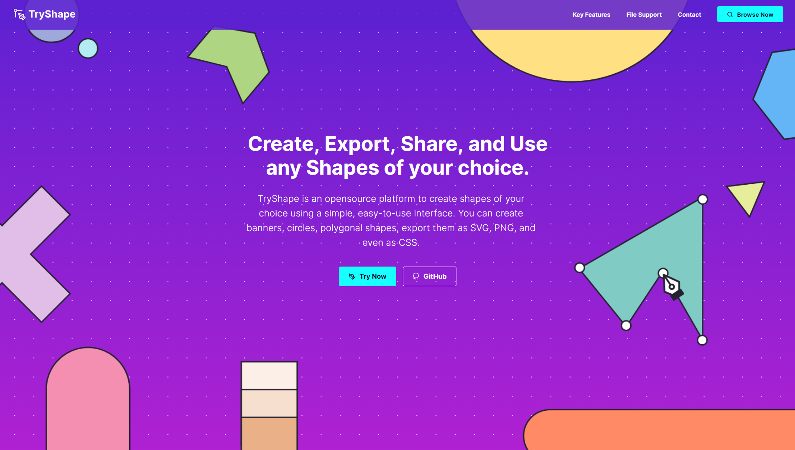

<!-- ALL-CONTRIBUTORS-BADGE:START - Do not remove or modify this section -->
[](#contributors-)
<!-- ALL-CONTRIBUTORS-BADGE:END -->
<p align="center">
    <a href="https://tryshape.vercel.app/" target="_blank">
        
    </a>
    
</p>
<p align="center">

</p>

<h4 align="center">Create, Export, Share, and Use any Shapes of your choice! 🌠</h4>

<p align="center">
<a href="https://github.com/TryShape/tryshape/blob/master/LICENSE" target="blank">

</a>
<a href="https://github.com/TryShape/tryshape/fork" target="blank">

</a>
<a href="https://github.com/TryShape/tryshape/stargazers" target="blank">

</a>
<a href="https://github.com/TryShape/tryshape/issues" target="blank">

</a>
<a href="https://github.com/TryShape/tryshape/pulls" target="blank">

</a>
<a href="https://twitter.com/intent/tweet?text=👋%20Check%20this%20amazing%20app%20https://tryshape.vercel.app/,%20created%20by%20@tapasadhikary%20and%20friends%0A%0A%23DEVCommunity%20%23100DaysOfCode%20%23tryshape"></a>

</p>

<p align="center">
    <a href="https://tryshape.vercel.app/" target="blank">View Demo</a>
    ·
    <a href="https://github.com/TryShape/tryshape/issues/new/choose">Report Bug</a>
    ·
    <a href="https://github.com/TryShape/tryshape/issues/new/choose">Request Feature</a>
</p>

# 👋 Introducing `TryShape`
<p align="center">
    <a href="https://tryshape.vercel.app" target="blank"/>
        
    </a>
</p>

`TryShape` is an opensource platform to create shapes of your choice using a simple, easy-to-use interface. You can create banners, circles, polygonal shapes, export them as SVG, PNG, and even as CSS.

# 🚀 Demo
Here is a quick demo of the app. We hope you enjoy it.

> [The Demo Link](https://www.youtube.com/watch?v=CB9xkhzkrYE)

Liked it? Please give a ⭐️ to <b>TryShape</b> to build its triceps 💪 stronger.

### Many Thanks to all the `Stargazers` who has supported this project with stars(⭐)

[](https://github.com/TryShape/tryshape/stargazers)

# 💻 Use TryShape
Please access TryShape using the URL:

> https://tryshape.vercel.app/

# 🔥 Features
`TryShape` comes with a bundle of features already. You can do the followings with it,

## 🔢 Listing Shapes
 - List out shapes for you to pick and use.

## 🏗️ Create Shapes
- Create any shapes using an intuitive editor.
- Create Polygonal, Circular, Elliptical shapes without knowing the underlying complexities like CSS clip-path.
- Add/Remove vertices, join them, drag-drop to position them to create a shape.
- Provide your choice of colors, add the contextual information as notes while creating the shapes.
- Are you an expert in CSS clip-path? Great, you can add a clip-path value directly and start from there.

## 📢 Controlling the Visibility of Shapes
- You can create a shape and share it with the TryShape community by making it public.
- Do you want to keep your creativity private? No worries, that's possible too.

## 💘 Like Shapes
- Liked a shape and want to add it to your shape collection? You can do that just with a click. Want to undo? That's supported as well.

## ✨ Export Shapes
- Export the shapes to use in your application.
- Export the shapes as PNG, JPEG, and SVG files.
- Single-Click Copy of the underlying CSS and clip-path property to use directly into your web app.

## 🔍 Search Shapes
- Search a shape with key-in search.

## 🎿 Sort Shapes
- Sort shapes by, most liked, recent, and oldest.

## 🔑 Authentication & Authorization
- Features like export, like, create, edit shapes need you to authenticate with the app. You can use your Gmail or GitHub credentials to authenticate to the app. It is secured and powered by `Google Firebase`.

## 📱 Responsive and mobile-friendly
- Use `TryShape` seamlessly from any device.

# 🏗️ How to Set up `TryShape` for Development?
You can run TryShape locally with a few easy steps.

1. Clone the repository

```bash
git clone https://github.com/TryShape/tryshape.git
```

2. Change the working directory

```bash
cd tryshape
```

3. Install dependencies 

```bash
npm install # or, yarn install
```

4. Create `.env` file in root and add your variables

```bash
NEXT_PUBLIC_DB_URL= YOUR_HARPER_DB_DATABASE_URL
NEXT_PUBLIC_DB_AUTHORIZATION= YOUR_HARPER_DB_AUTHORIZATION_ID

NEXT_PUBLIC_FIREBASE_AUTHORIZATION=YOUR_FIREBASE_AUTH_KEY
NEXT_PUBLIC_FIREBASE_AUTH_DOMAIN=YOUR_FIREBASE_AUTH_DOMAIN
NEXT_PUBLIC_FIREBASE_PROJECT_ID=YOUR_FIREBASE_PROJECT_ID
NEXT_PUBLIC_FIREBASE_STORAGE_BUCKET=YOUR_FIREBASE_PROJECT_BUCKET
NEXT_PUBLIC_FIREBASE_MESSAGING_SERNDER_ID=YOUR_FIREBASE_MESSAGING_SERNDER_ID
NEXT_PUBLIC_FIREBASE_APP_ID=YOUR_FIREBASE_APP_ID
NEXT_PUBLIC_FIREBASE_MEASUREMENT_ID=YOUR_FIREBASE_MEASUREMENT_ID
```

5. Run the app

```bash
npm run dev # or, yarn dev
```

That's All!!! Now open [localhost:3000](http://localhost:3000/) to see the app.

# 🍔 Built With
- [Next JS](https://nextjs.org/): The coolest React-based framework on the planet
- [Harper DB](https://harperdb.io/): A flexible Data Store
- [react-icons](https://react-icons.github.io/react-icons/): One shop for all the icons
- [react-hot-toast](https://react-hot-toast.com/): Super cool toast messages
- [firebase](https://firebase.google.com/): Authentication services
- [date-fns](https://date-fns.org/): Date formatting
- [axios](https://github.com/axios/axios): Makes API calls easy
- [react-bootstrap](https://react-bootstrap.github.io/): A popular frontend framework built-for React
- [Styled Components](https://styled-components.com/): Visual primitives for the component age
- [react-clip-path](https://github.com/atapas/react-clip-path#readme): A home grown module to handle clip-path property in a React app.
- [react-draggable](https://github.com/mzabriskie/react-draggable): Make a HTML element draggable in React
- [react-loader-spinner](https://mhnpd.github.io/react-loader-spinner/): Provides simple React SVG spinner component which can be implemented for async await operation before data loads to the view
- [react-switch](https://github.com/markusenglund/react-switch#readme): A draggable toggle-switch component for React.
- [downloadjs](http://danml.com/download.html): Trigger a download from JavaScript
- [html-to-image](https://github.com/bubkoo/html-to-image#readme): Converts an HTML element to image
- [Vercel](http://vercel.com/): Best for Hosting a Next.js app

# 🛡️ License
This project is licensed under the MIT License - see the [`LICENSE`](LICENSE) file for details.

# 🦄 Upcoming Features
`TryShape` has all the potentials to grow further. Here are some of the upcoming features planned(not in any order),

- ✔️ Add the ability to create shape using SVG elements to support Curvy Node adjustments.
- ✔️ Manage your shape collection
- ✔️ Import shapes
- ✔️ Following a contributor.
- ✔️ PWA(Progressive Web App)
- ✔️ Flexible Datastore
- ✔️ Better Performance
- ✔️ Tagging a shape
- ✔️ Cloning a shape
- ✔️ Provide comment on a shape.
- ✔️ More authentication mechanisms like twitter, facebook, etc.

If you find something is missing, `TryShape` is listening. Please create a feature request [from here](https://github.com/TryShape/tryshape/issues/new/choose).

# 🏃‍♀️ Deploy

<a href="https://vercel.com/new/project?template=https://github.com/TryShape/tryshape">

</a>
<a href="https://app.netlify.com/start/deploy?repository=https://github.com/TryShape/tryshape">

</a>


# 🤝 Contributing to `TryShape`
Any kind of positive contribution is welcome! Please help us to grow by contributing to the project.

If you wish to contribute, you can work on any features [listed here](https://github.com/TryShape/tryshape#-upcoming-features) or create one on your own. After adding your code, please send us a Pull Request.

> Please read [`CONTRIBUTING`](CONTRIBUTING.md) for details on our [`CODE OF CONDUCT`](CODE_OF_CONDUCT.md), and the process for submitting pull requests to us.

#  Support ❤️
We all need support and motivation. `TryShape` is not an exception. Please give this project a ⭐️ to encourage and show that you liked it. Don't forget to leave a star ⭐️ before you move away.

If you found the app helpful, consider supporting us with a coffee.

<a href="https://www.buymeacoffee.com/greenroots">
    
</a>

---

<h3 align="center">
A ⭐️ to <b>TryShape</b> is to build its triceps 💪 stronger!
</h3>


## Contributors ✨

Thanks goes to these wonderful people ([emoji key](https://allcontributors.org/docs/en/emoji-key)):

<!-- ALL-CONTRIBUTORS-LIST:START - Do not remove or modify this section -->
<!-- prettier-ignore-start -->
<!-- markdownlint-disable -->
<table>
  <tr>
    <td align="center"><a href="https://tapasadhikary.com"><br /><sub><b>Tapas Adhikary</b></sub></a><br /><a href="https://github.com/TryShape/tryshape/commits?author=atapas" title="Code">💻</a> <a href="#infra-atapas" title="Infrastructure (Hosting, Build-Tools, etc)">🚇</a> <a href="https://github.com/TryShape/tryshape/commits?author=atapas" title="Tests">⚠️</a> <a href="#blog-atapas" title="Blogposts">📝</a> <a href="#ideas-atapas" title="Ideas, Planning, & Feedback">🤔</a> <a href="#mentoring-atapas" title="Mentoring">🧑‍🏫</a> <a href="#platform-atapas" title="Packaging/porting to new platform">📦</a> <a href="#projectManagement-atapas" title="Project Management">📆</a></td>
    <td align="center"><a href="https://github.com/nirmalkc"><br /><sub><b>Nirmal Kumar</b></sub></a><br /><a href="https://github.com/TryShape/tryshape/commits?author=nirmalkc" title="Tests">⚠️</a> <a href="https://github.com/TryShape/tryshape/commits?author=nirmalkc" title="Code">💻</a> <a href="#design-nirmalkc" title="Design">🎨</a></td>
    <td align="center"><a href="https://github.com/williamzhu17"><br /><sub><b>William Zhu</b></sub></a><br /><a href="https://github.com/TryShape/tryshape/commits?author=williamzhu17" title="Tests">⚠️</a> <a href="https://github.com/TryShape/tryshape/commits?author=williamzhu17" title="Code">💻</a></td>
    <td align="center"><a href="https://savio.xyz/"><br /><sub><b>Savio Martin</b></sub></a><br /><a href="https://github.com/TryShape/tryshape/commits?author=saviomartin" title="Tests">⚠️</a> <a href="https://github.com/TryShape/tryshape/commits?author=saviomartin" title="Code">💻</a> <a href="https://github.com/TryShape/tryshape/issues?q=author%3Asaviomartin" title="Bug reports">🐛</a></td>
    <td align="center"><a href="http://www.sangamone.com"><br /><sub><b>ckuthyar</b></sub></a><br /><a href="https://github.com/TryShape/tryshape/issues?q=author%3Ackuthyar" title="Bug reports">🐛</a></td>
  </tr>
</table>

<!-- markdownlint-restore -->
<!-- prettier-ignore-end -->

<!-- ALL-CONTRIBUTORS-LIST:END -->

This project follows the [all-contributors](https://github.com/all-contributors/all-contributors) specification. Contributions of any kind welcome!
